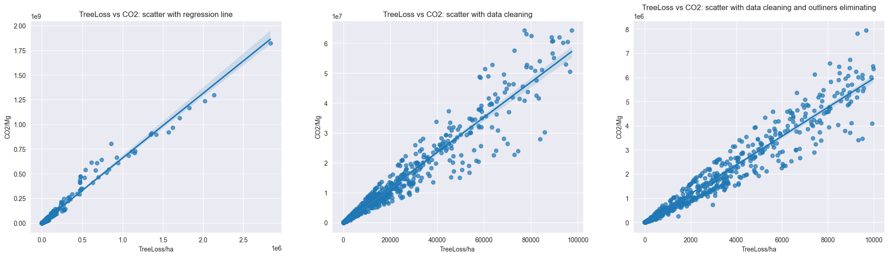
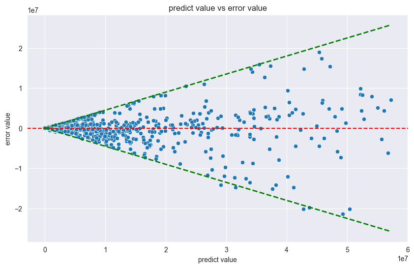
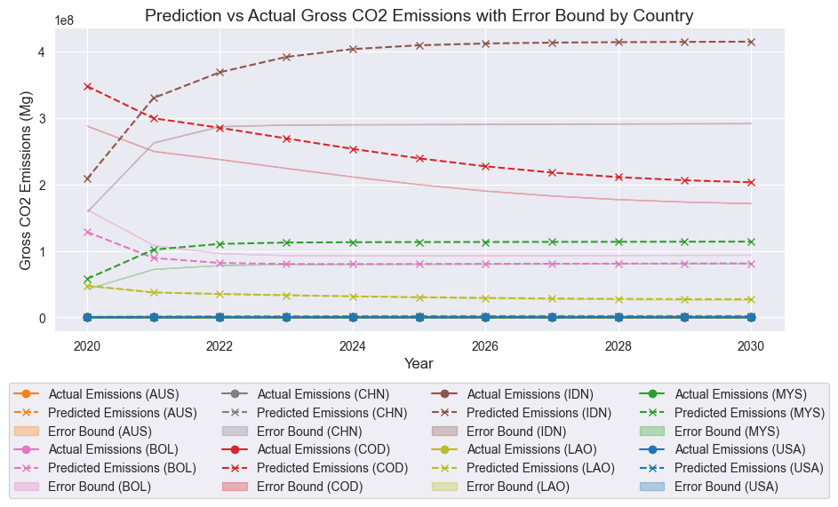
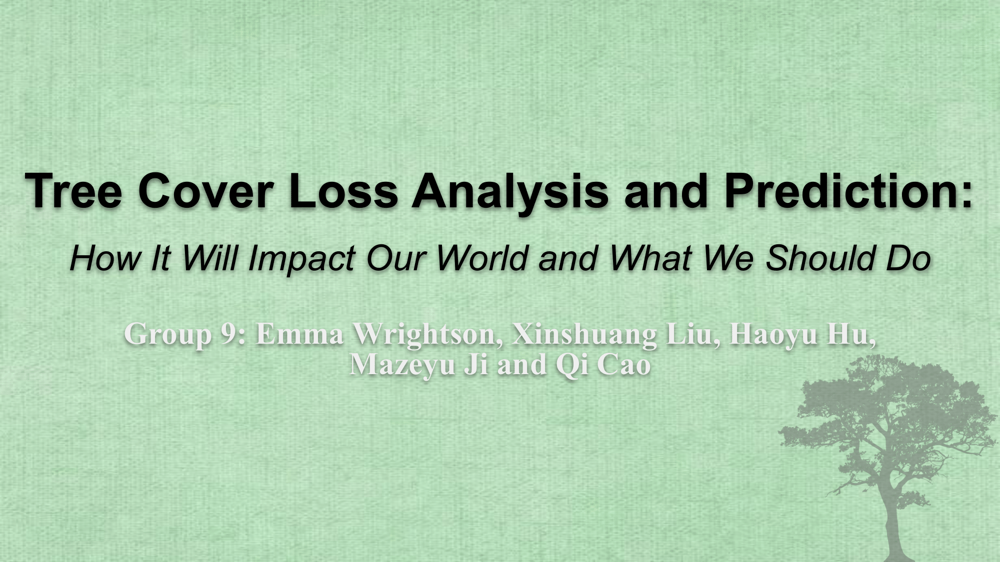

# **Tree Coverage Analysis**

## **Team 9**

### **Authors**
- Emma Wrightson: ewrightson@ucsd.edu  
- Xinshuang Liu: xil235@ucsd.edu
- Haoyu Hu: hah034@ucsd.edu     
- Mazeyu Ji: m3ji@ucsd.edu  
- Qi Cao: q9cao@ucsd.edu  

---

## **Project Description**
This project investigates global tree loss across countries and regions from 2001 to 2020. It examines the gross CO2 emissions associated with tree loss and explores its primary causes. The project includes predictive modeling to forecast future tree loss trends and their potential correlation with CO2 emissions.

---

## **Code Overview**
### What the Code Does
1. **Data Analysis and Visualization**:
   - Analyzes historical data on tree loss and CO2 emissions.
   - Creates insightful visualizations to illustrate trends.
2. **Prediction Modeling**:
   - Develops machine learning models to predict future tree loss trends.
3. **Insight Generation**:
   - Correlates tree loss with CO2 emissions and identifies key contributing factors.

---

## **File Structure**

```bash
TreeCoverageAnalysis/
│
├── input_data/                         # Contains raw data files.
│   ├── country_code_info.csv           # Dataset with country codes.
│   ├── TreeCoverLoss_2001-2020 _InPrimaryForest.csv  # Primary forest dataset.
│   ├── TreeCoverLoss_2001-2020_ByRegion.csv          # Main dataset by region.
│   └── TreeCoverLoss_2001-2020_DominantDrivers.csv   # Dataset on dominant drivers.
│
├── output_data/                                # Contains prediction results and visualizations.
│   ├── html_primary/                           # Interactive visualizations for tree cover loss and CO2.
│   ├── html_region/                            # Interactive visualizations for tree cover loss and CO2.
│   ├── past_and_future_ByRegion.csv            # Combined past data and prediction based on the main dataset.
│   ├── past_and_future_InPrimaryForest.csv     # Combined past data and prediction based on the primary forest dataset.
│   ├── prediction_ByRegion.csv                 # Predictions based on the main dataset.
│   ├── prediction_InPrimaryForest.csv          # Predictions based on the primary forest dataset.
│   └── *.png                                   # Visualization output.
│
├── Statistics/                                 # Exploratory data analysis and statistics.
│   ├── Basic Statistics Countries.json         # Country-level statistics on tree cover loss and CO2.
│   ├── Basic Statistics Drivers.json           # Driver-level statistics on tree cover loss and CO2.
│   ├── Distribution_of_Records_Per_Country.png # Record counts by country.
│   ├── Distribution_of_Records_Per_Driver.png  # Record counts by driver type.
│   ├── Distribution_of_Records_Per_Year_Countries.png # Yearly record counts by country.
│   └── Distribution_of_Records_Per_Year_Drivers.png   # Yearly record counts by driver type.
│
├── correlation_analysis.py           # Correlation between tree cover loss and CO2.
├── dataset.py                        # Dataset class definition for loading and preprocessing data.
├── Gaussian_process_regression.py    # Jupyter notebook for prediction modeling using Gaussian process regression.
├── Group_9_Tree_Loss_Analysis_Presentation.pdf #PDF file of our final presentation
├── main.py                           # Main script to run the project pipeline.
├── prediction_accuracy_test.py       # Validate the accuracy of the predicted tree cover loss.
├── prediction_baselines_statistical_methods.py # Script for baseline prediction models.
├── README.md                         # Documentation for the project.
├── requirements.txt                  # Required modules for the project.
├── visualization.ipynb               # Jupyter notebook for generating visualizations.
└── visualizer.py                     # Python script for visualization tasks.
```

---

## **Visualizations**

### **Interactive Visualizations**
The project includes several interactive visualizations to explore trends in tree loss and CO2 emissions. These visualizations are available in the **`output_data/html_primary/`** and **`output_data/html_region/`** directories. To view them:  
1. Open the `.html` files in a web browser.  
2. Explore the interactive plots for deeper insights.  

### **Static Visualizations**
Below are some example graphs generated during the analysis:  

1. **Correlations between CO2 and Tree Loss**  
     

2. **Predicted Value vs Error**  
     

3. **Prediction vs Actual CO2 Emissions by Country**  
     

---

## **How to Run the Code**
1. **Clone the Repository**:
   ```bash
   git clone https://github.com/XinshuangL/TreeCoverageAnalysis.git
   cd TreeCoverageAnalysis
   ```
2. **Install Dependencies**:
    - Ensure you have Python 3.8+ installed.
    - Install the required libraries using the command:
   ```bash
   pip install -r requirements.txt
   ```
3. **Run the main script**:
   ```bash
   python3 main.py
   ```
4. **Run Visuals Jupyter Notebook**:
   ```bash
   visualization.ipynb
   ```
### Note:
Running the `main.py` file will create the prediction.csv files as well as generate the predicted `.csv` files `prediction_ByRegion.csv` and `prediction_InPrimaryForest.csv` in the `output_data` file, as well as provide statistical analysis on the Gaussian Regression model. Then, when you run the `visualization.ipynb`, the visualizations will then be created.

---

## **Third Party Libraries**
In order to predict and visualize our data, we incorporated several third party libraries including:
- plotly
- pandas
- os
- matplotlib
- numpy
- torch
- json
- math
- warnings
- sklearn
- seaborn
- statsmodels

---

## **Final Presentation**
Our project findings and insights are compiled in a presentation available here:

[ECE143_Group_9_Final_Presentation.pdf](https://docs.google.com/presentation/d/1qYn_WN-LpJIszPvLomJdqw3qk8KqCV9Ftj36vBX77S0/edit#slide=id.g31bf258b86b_1_41)


---

## **Summary**
This repository offers a comprehensive study on tree coverage loss and its environmental impact, using data analysis, machine learning, and advanced visualization. Follow the instructions above to explore the code and reproduce the results.